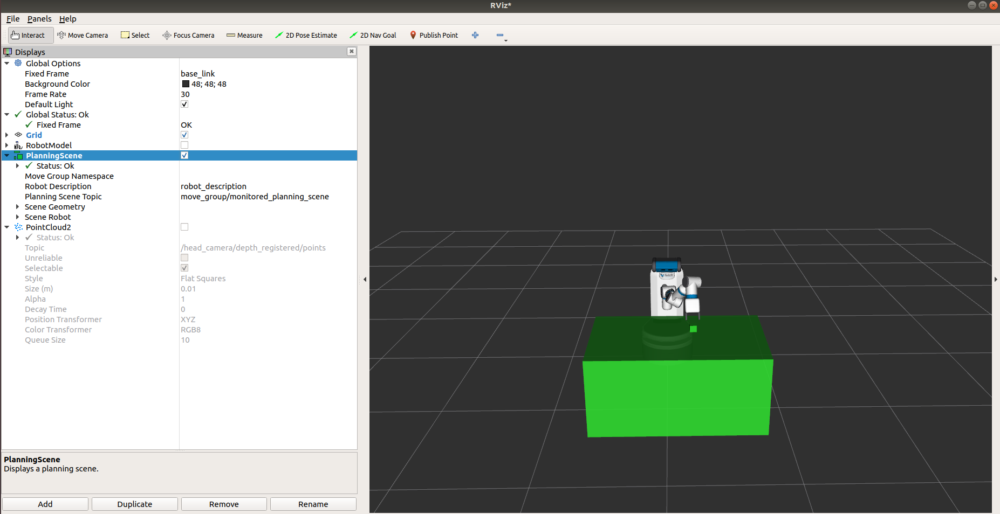
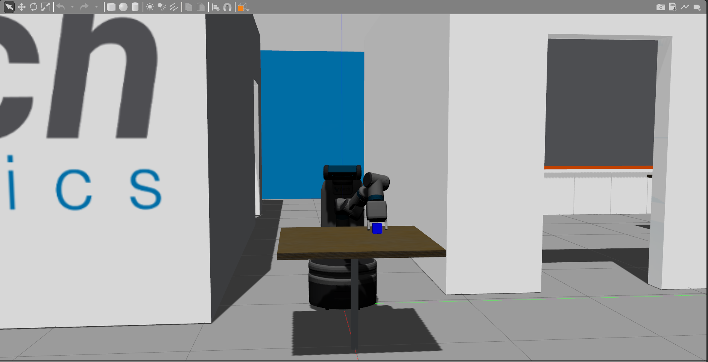
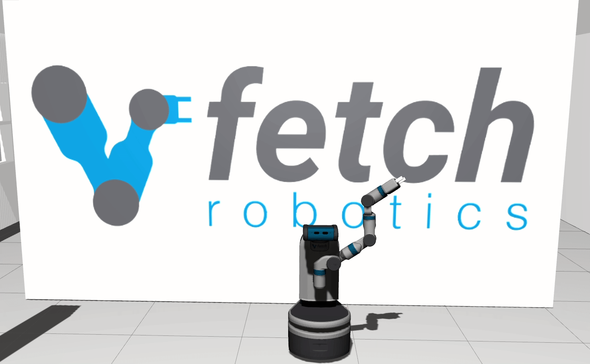
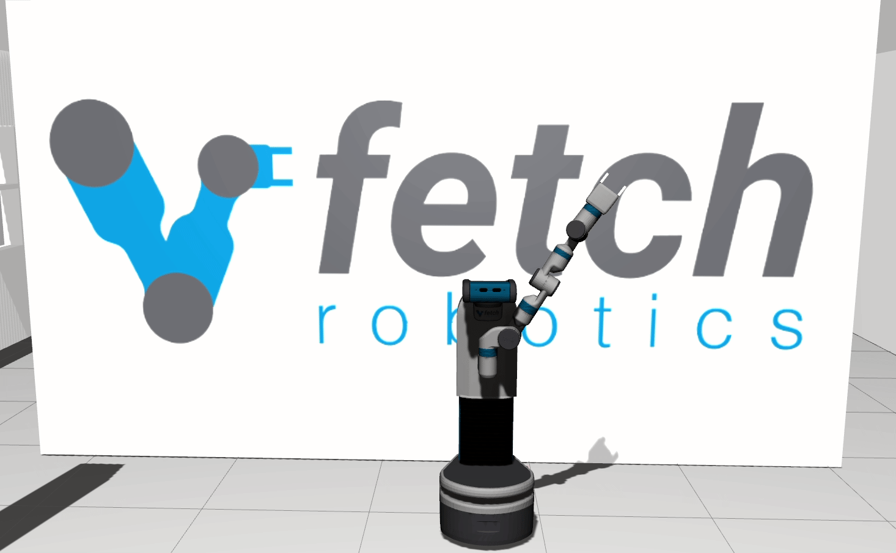

Tutorial: Manipulation
======================

Once you have Fetch running, you can start moving the arm with MoveIt!

Getting Started Demo
--------------------

The easiest way to run MoveIt! is to run the demo launch file,
which does not require any simulator or robot and brings up a
fully configured RVIZ instance:

::

    >$ roslaunch fetch_moveit_config demo.launch

Within this demo you can use the sliders of the joint state
publisher window to move the joints to new starting positions
and use interactive markers to create new locations to plan
to and from.

Running the Pick and Place Demo
-------------------------------
Pick and Place Demo
~~~~~~~~~~~~~~~~~~~

Follow the commands to run the pick and place demo in the Gazebo. First, launch the Gazebo. 

::

    roslaunch fetch_gazebo pickplace_playground.launch

After the Gazebo is fully launched, launch the pick and place demo.

:: 

    roslaunch fetch_gazebo_demo pick_place_demo.launch 

After entering the commands, you should see something like the video below.

.. raw:: html

    

        <iframe width="700px" height="400px" src="https://www.youtube.com/embed/mfUdIxrt7DM" frameborder="0" allow="autoplay; encrypted-media" allowfullscreen></iframe>
    

Code Explain
~~~~~~~~~~~~
The manipulation node receive the message from the perception node by a message type named Object
under the grasping_msgs. Which could be found `here <http://wiki.ros.org/grasping_msgs>`_. 
Here is the format of the message:
::

    ###########################################################
    # This message describes an object.

    # Many of the geometric items below lack a stamp/frame_id,
    # header stamp/frame_id should be used there
    std_msgs/Header header

    # An object might have a name
    string name

    # An object might have a known (named) support surface
    string support_surface

    # Objects might have properties, such as type/class, or color, etc.
    ObjectProperty[] properties

    ###########################################################
    # Objects have many possible descriptions
    #  The following are the possible description formats

    # Perception modules often represent an object as a cluster of points
    #  Is considered valid if number of points > 0
    sensor_msgs/PointCloud2 point_cluster

    # MoveIt prefers solid primitives or meshes as a description of objects
    shape_msgs/SolidPrimitive[] primitives
    geometry_msgs/Pose[] primitive_poses

    shape_msgs/Mesh[] meshes
    geometry_msgs/Pose[] mesh_poses

    # An object representing a support surface might be described by a plane
    # Is considered valid if coefficients are not all 0s.
    shape_msgs/Plane surface

Once the grasping node has received the information it needs, 
it will add the surfaces (in the pick place play ground the surface is the table) 
as well as the grspable objects in the `planning scene <http://docs.ros.org/melodic/api/moveit_tutorials/html/doc/planning_scene/planning_scene_tutorial.html>`_
by the lines below in the function updateScene. 

:: 

    for obj in find_result.objects:
        idx += 1
        obj.object.name = "object%d"%idx
        self.scene.addSolidPrimitive(obj.object.name,
                                        obj.object.primitives[0],
                                        obj.object.primitive_poses[0],
                                        use_service = False)
        if obj.object.primitive_poses[0].position.x < 0.85:
            objects.append([obj, obj.object.primitive_poses[0].position.z])

    for obj in find_result.support_surfaces:
        # extend surface to floor, and make wider since we have narrow field of view
        height = obj.primitive_poses[0].position.z
        obj.primitives[0].dimensions = [obj.primitives[0].dimensions[0],
                                        1.5,  # wider
                                        obj.primitives[0].dimensions[2] + height]
        obj.primitive_poses[0].position.z += -height/2.0

        # add to scene
        self.scene.addSolidPrimitive(obj.name,
                                        obj.primitives[0],
                                        obj.primitive_poses[0],
                                        use_service = True
                                        )

You could observe the objects have been added to the planning scene by launching rviz.
:: 

    rviz

|pic1| |pic2|

The pick and place are completed through `moveit_python.pick_place_interface.PickPlaceInterface <http://docs.ros.org/jade/api/moveit_python/html/classmoveit__python_1_1pick__place__interface_1_1PickPlaceInterface.html>`_. 
The functions pick and place take in the `moveit_msgs/Grasp <http://docs.ros.org/melodic/api/moveit_msgs/html/msg/Grasp.html>`_ and Object type messages to complete the actions.

You could also run the demo with the navigation,
See :ref:`mm_demo`.

Pick Cubes into Bins by Color
-----------------------------

.. raw:: html

    

        <iframe width="700px" height="400px" src="https://www.youtube.com/embed/eceIC79FPKg" frameborder="0" allow="autoplay; encrypted-media" allowfullscreen></iframe>
    

The Fetch will scan the environment first and use the combined pointcloud to find out graspable obejcts. 

Running MoveIt! on a Robot
-----------------------------

To run MoveIt! on a real or simulated robot, launch the
move_group.launch file from the ``fetch_moveit_config`` package:

::

  >$ roslaunch fetch_moveit_config move_group.launch

Once launched you can send commands to move the arm using
the `MoveIt! Rviz Plugin <http://docs.ros.org/indigo/api/moveit_ros_visualization/html/doc/tutorial.html>`_ or use the programming interface, ``move_group_interface``, in either `C++ <http://docs.ros.org/indigo/api/pr2_moveit_tutorials/html/planning/src/doc/move_group_interface_tutorial.html>`_ or `Python <http://docs.ros.org/indigo/api/pr2_moveit_tutorials/html/planning/scripts/doc/move_group_python_interface_tutorial.html>`_.

Simple MoveIt! Disco Example
----------------------------

This python script will run the robot through a simple disco dance motion.

::

  #!/usr/bin/env python

  # simple_disco.py: Move the fetch arm through a simple disco motion
  import rospy
  from moveit_msgs.msg import MoveItErrorCodes
  from moveit_python import MoveGroupInterface, PlanningSceneInterface

  # Note: fetch_moveit_config move_group.launch must be running
  # Safety!: Do NOT run this script near people or objects.
  # Safety!: There is NO perception.
  #          The ONLY objects the collision detection software is aware
  #          of are itself & the floor.
  if __name__ == '__main__':
      rospy.init_node("simple_disco")

      # Create move group interface for a fetch robot
      move_group = MoveGroupInterface("arm_with_torso", "base_link")

      # Define ground plane
      # This creates objects in the planning scene that mimic the ground
      # If these were not in place gripper could hit the ground
      planning_scene = PlanningSceneInterface("base_link")
      planning_scene.removeCollisionObject("my_front_ground")
      planning_scene.removeCollisionObject("my_back_ground")
      planning_scene.removeCollisionObject("my_right_ground")
      planning_scene.removeCollisionObject("my_left_ground")
      planning_scene.addCube("my_front_ground", 2, 1.1, 0.0, -1.0)
      planning_scene.addCube("my_back_ground", 2, -1.2, 0.0, -1.0)
      planning_scene.addCube("my_left_ground", 2, 0.0, 1.2, -1.0)
      planning_scene.addCube("my_right_ground", 2, 0.0, -1.2, -1.0)

      # TF joint names
      joint_names = ["torso_lift_joint", "shoulder_pan_joint",
                     "shoulder_lift_joint", "upperarm_roll_joint",
                     "elbow_flex_joint", "forearm_roll_joint",
                     "wrist_flex_joint", "wrist_roll_joint"]
      # Lists of joint angles in the same order as in joint_names
      disco_poses = [[0.0, 1.5, -0.6, 3.0, 1.0, 3.0, 1.0, 3.0],
                     [0.133, 0.8, 0.75, 0.0, -2.0, 0.0, 2.0, 0.0],
                     [0.266, -0.8, 0.0, 0.0, 2.0, 0.0, -2.0, 0.0],
                     [0.385, -1.5, 1.1, -3.0, -0.5, -3.0, -1.0, -3.0],
                     [0.266, -0.8, 0.0, 0.0, 2.0, 0.0, -2.0, 0.0],
                     [0.133, 0.8, 0.75, 0.0, -2.0, 0.0, 2.0, 0.0],
                     [0.0, 1.5, -0.6, 3.0, 1.0, 3.0, 1.0, 3.0]]

      for pose in disco_poses:
          if rospy.is_shutdown():
              break

          # Plans the joints in joint_names to angles in pose
          move_group.moveToJointPosition(joint_names, pose, wait=False)

          # Since we passed in wait=False above we need to wait here
          move_group.get_move_action().wait_for_result()
          result = move_group.get_move_action().get_result()

          if result:
              # Checking the MoveItErrorCode
              if result.error_code.val == MoveItErrorCodes.SUCCESS:
                  rospy.loginfo("Disco!")
              else:
                  # If you get to this point please search for:
                  # moveit_msgs/MoveItErrorCodes.msg
                  rospy.logerr("Arm goal in state: %s",
                               move_group.get_move_action().get_state())
          else:
              rospy.logerr("MoveIt! failure no result returned.")

      # This stops all arm movement goals
      # It should be called when a program is exiting so movement stops
      move_group.get_move_action().cancel_all_goals()

Simple MoveIt! Wave Example
---------------------------

This python script will cause the robot to do a simple "wave-like" motion
until the script is stopped with ctrl-c

::

  #!/usr/bin/env python

  # wave.py: "Wave" the fetch gripper
  import rospy
  from moveit_msgs.msg import MoveItErrorCodes
  from moveit_python import MoveGroupInterface, PlanningSceneInterface
  from geometry_msgs.msg import PoseStamped, Pose, Point, Quaternion

  # Note: fetch_moveit_config move_group.launch must be running
  # Safety!: Do NOT run this script near people or objects.
  # Safety!: There is NO perception.
  #          The ONLY objects the collision detection software is aware
  #          of are itself & the floor.
  if __name__ == '__main__':
      rospy.init_node("hi")

      # Create move group interface for a fetch robot
      move_group = MoveGroupInterface("arm_with_torso", "base_link")

      # Define ground plane
      # This creates objects in the planning scene that mimic the ground
      # If these were not in place gripper could hit the ground
      planning_scene = PlanningSceneInterface("base_link")
      planning_scene.removeCollisionObject("my_front_ground")
      planning_scene.removeCollisionObject("my_back_ground")
      planning_scene.removeCollisionObject("my_right_ground")
      planning_scene.removeCollisionObject("my_left_ground")
      planning_scene.addCube("my_front_ground", 2, 1.1, 0.0, -1.0)
      planning_scene.addCube("my_back_ground", 2, -1.2, 0.0, -1.0)
      planning_scene.addCube("my_left_ground", 2, 0.0, 1.2, -1.0)
      planning_scene.addCube("my_right_ground", 2, 0.0, -1.2, -1.0)

      # This is the wrist link not the gripper itself
      gripper_frame = 'wrist_roll_link'
      # Position and rotation of two "wave end poses"
      gripper_poses = [Pose(Point(0.042, 0.384, 1.826),
                            Quaternion(0.173, -0.693, -0.242, 0.657)),
                       Pose(Point(0.047, 0.545, 1.822),
                            Quaternion(-0.274, -0.701, 0.173, 0.635))]

      # Construct a "pose_stamped" message as required by moveToPose
      gripper_pose_stamped = PoseStamped()
      gripper_pose_stamped.header.frame_id = 'base_link'

      while not rospy.is_shutdown():
          for pose in gripper_poses:
              # Finish building the Pose_stamped message
              # If the message stamp is not current it could be ignored
              gripper_pose_stamped.header.stamp = rospy.Time.now()
              # Set the message pose
              gripper_pose_stamped.pose = pose

              # Move gripper frame to the pose specified
              move_group.moveToPose(gripper_pose_stamped, gripper_frame)
              result = move_group.get_move_action().get_result()

              if result:
                  # Checking the MoveItErrorCode
                  if result.error_code.val == MoveItErrorCodes.SUCCESS:
                      rospy.loginfo("Hello there!")
                  else:
                      # If you get to this point please search for:
                      # moveit_msgs/MoveItErrorCodes.msg
                      rospy.logerr("Arm goal in state: %s",
                                   move_group.get_move_action().get_state())
              else:
                  rospy.logerr("MoveIt! failure no result returned.")

      # This stops all arm movement goals
      # It should be called when a program is exiting so movement stops
      move_group.get_move_action().cancel_all_goals()

More information and Tutorials on MoveIt!
-----------------------------------------

`General information <http://moveit.ros.org/>`_, `Documentation <http://moveit.ros.org/documentation/>`_ and `Tutorials <http://moveit.ros.org/documentation/tutorials/>`_ available at moveit.ros.org

